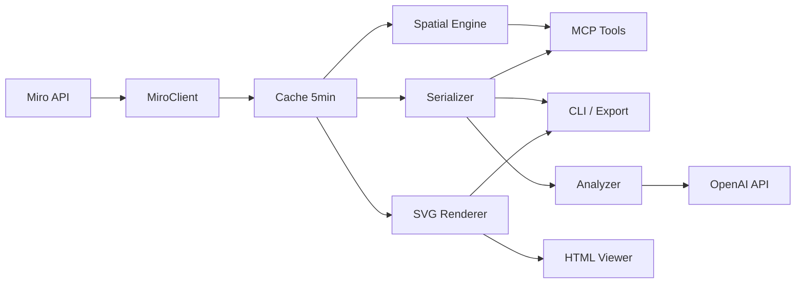
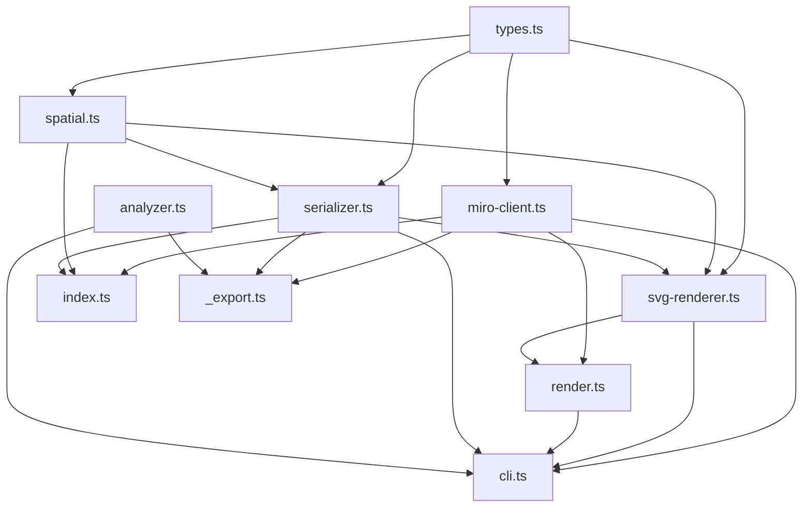

# MiroEx — Technical Context

## Обзор

MCP-сервер для чтения Miro-досок. Превращает визуальные доски в структурированный текст для LLM. Read-only, TypeScript, минимум зависимостей. Включает SVG-рендерер и интерактивный CLI.

## Архитектура

```
src/index.ts        — MCP server entry, 6 tool registrations
src/miro-client.ts  — Miro REST API v2 client (pagination, caching, coordinate normalization)
src/spatial.ts      — DBSCAN clustering, bounding box, position serialization
src/serializer.ts   — Board → structured text for LLM (stripHtml, itemContent, serializeBoard)
src/svg-renderer.ts — Board → SVG string (visual rendering of all item types + connectors)
src/analyzer.ts     — OpenAI-based board analysis (analyzeBoard, chatAboutBoard)
src/render.ts       — CLI: render board to interactive HTML or bare SVG
src/_export.ts      — CLI: export raw JSON + serialized text + optional LLM analysis to output/
src/cli.ts          — CLI: interactive menu (board selection, actions, loop)
src/types.ts        — TypeScript interfaces (MiroItem, MiroConnector, BoardCache, BoundingBox, Cluster)
```

### Потоки данных



**MCP Flow:** Tool call → MiroClient (cached) → Spatial Engine → Serializer → Text response

**CLI Flow:** Interactive menu → MiroClient → Action (render/export/analyze/info) → Output

**Analyze Flow:** Serializer → text → OpenAI (analysis + insights) → markdown files → interactive chat

**Render Flow:** CLI args → MiroClient → `renderBoardToSvg()` → HTML wrapper (pan/zoom JS) → file + `open`

## Ключевые типы

```typescript
MiroBoard      — id, name, description, createdAt, modifiedAt
MiroItem       — id, type, data?, style?, position?, geometry?, parent?
MiroConnector  — id, startItem?, endItem?, captions?, style?
BoardCache     — board (MiroBoard), items[], connectors[], fetchedAt
BoundingBox    — minX, minY, maxX, maxY
Cluster        — id, items[], centroid {x, y}, bounds (BoundingBox)
```

## Ключевые решения

1. **LLM interprets semantics** — код только структурирует данные, без эвристик типа "что является решением"
2. **Spatial clustering** — DBSCAN группирует близкие элементы; позиции как "top-left", "center" и т.д.
3. **In-memory cache** — 5min TTL на доску, `force_refresh` для обхода
4. **Cursor pagination** — Miro API возвращает результаты постранично, `fetchAllPages()` обрабатывает
5. **Coordinate normalization** — `normalizePositions()` конвертирует parent-relative в абсолютные canvas-координаты
6. **SVG via foreignObject** — текст через HTML div в `<foreignObject>` для word-wrap, центрирования и кириллицы
7. **Zero rendering deps** — SVG renderer и HTML viewer без внешних библиотек

## API Endpoints

Base URL: `https://api.miro.com/v2`
Auth: `Bearer ${MIRO_API_TOKEN}`

| Endpoint | Описание |
|----------|----------|
| `GET /boards` | Список досок пользователя (sort=last_modified) |
| `GET /boards/{id}` | Метаданные доски |
| `GET /boards/{id}/items?limit=50` | Все элементы (paginated) |
| `GET /boards/{id}/connectors?limit=50` | Все коннекторы (paginated) |

## Ключевые компоненты

### MiroClient (`src/miro-client.ts`)

```typescript
class MiroClient {
  listBoards(): Promise<MiroBoard[]>           // GET /boards
  getBoardInfo(boardId): Promise<MiroBoard>     // GET /boards/{id}
  getBoardData(boardId, force?): Promise<BoardCache>  // fetch + normalize + cache
  fetchAllPages<T>(url): Promise<T[]>           // cursor pagination
}
```

- `normalizePositions(items)` — конвертирует `relativeTo: "parent_top_left"` в абсолютные координаты рекурсивно

### Spatial Engine (`src/spatial.ts`)

| Функция | Описание |
|---------|----------|
| `getItemCenter(item)` | `{x, y} \| null` |
| `getItemDiagonal(item)` | Диагональ bbox (default 100) |
| `getBoardBounds(items)` | Enclosing BoundingBox |
| `clusterItems(items, radius?)` | BFS-based DBSCAN, radius = mean(diagonal) * 3 |
| `sortReadingOrder(items)` | Top-to-bottom, left-to-right (50px row tolerance) |
| `describePosition(x, y, bounds)` | 3x3 grid: "top-left", "center" и т.д. |

### Serializer (`src/serializer.ts`)

| Функция | Описание |
|---------|----------|
| `stripHtml(html)` | HTML → plain text (теги + entities + numeric codes) |
| `itemContent(item)` | Текст элемента по типу (max 200 chars) |
| `itemLabel(item)` | `[type/color]` метка |
| `formatConnections(conns)` | Форматирование связей в текст |
| `serializeBoard(cache, maxTokens?)` | Полная сериализация: frames → clusters → cross-frame connections |

### SVG Renderer (`src/svg-renderer.ts`)

- `renderBoardToSvg(items, connectors, boardName?)` → SVG string
- Типы элементов: frame (dashed rect), sticky_note (colored rect), shape (rect/ellipse/diamond/triangle), text, card (white + blue stripe), image (grey placeholder)
- Коннекторы: линия укорочена на 35% diagonal от каждого конца, arrow markers, dashed, midpoint labels
- Layer order: frames → items → connectors
- Rotation: `<g transform="rotate()">` при наличии `geometry.rotation`
- Named colors (yellow, green и т.д.) → hex mapping
- Adaptive font size: `sqrt(area / charCount)`

### Analyzer (`src/analyzer.ts`)

```typescript
analyzeBoard(serializedText, boardName, boardId, stats): Promise<{analysis, insights}>
chatAboutBoard(serializedText, analysis, insights): Promise<void>
```

- `analyzeBoard()` — два последовательных вызова OpenAI (gpt-4o): analysis, затем insights (insights получает analysis как контекст)
- `chatAboutBoard()` — интерактивный чат с streaming, system message содержит доску + analysis + insights
- Промпты на русском, формат из примеров в `output/онтология/` и `output/Штуковина/`

### Interactive CLI (`src/cli.ts`)

- `parseBoardId(raw)` — извлекает ID из Miro URL или возвращает как есть
- `selectBoard(miro)` — список досок из API + ручной ввод (fallback)
- `selectAction()` — render HTML/SVG, export, analyze, info
- `runAction(action, cache)` — выполняет действие
- Main loop: board → action → next (same/other/exit)
- Поддерживает `argv[2]` для прямого указания board ID

### Render CLI (`src/render.ts`)

```
npx tsx src/render.ts <board_id> [-o path] [--svg-only]
```

- `wrapHtml(svgContent, boardName)` — экспортируемая функция: SVG → HTML с pan/zoom
- Auto-opens в браузере на macOS
- Guard: `main()` не выполняется при import (только при прямом запуске)

### Export CLI (`src/_export.ts`)

```
npx tsx src/_export.ts <board_id>
```

Сохраняет в `output/<board_name>/`: `01-raw-data.json`, `02-serialized.txt`, опционально `03-analysis.md` и `04-insights.md` (при наличии `OPENAI_API_KEY`)

## MCP Tools (6 штук)

| Tool | Input | Output |
|------|-------|--------|
| `miro_read_board` | `board_id, force_refresh?` | name, stats, frames, top-level preview |
| `miro_get_frame_content` | `board_id, frame_id` | items, clusters, internal connections |
| `miro_get_clusters` | `board_id, cluster_radius?` | frame groups + free spatial clusters |
| `miro_get_connections` | `board_id` | full connector graph with context |
| `miro_search` | `board_id, query` | matching items with frame/connection context |
| `miro_get_board_as_text` | `board_id, max_tokens?` | full board as structured text |

## Граф зависимостей модулей



Циклических зависимостей нет.

## Конфигурация

| Параметр | Источник | Описание | По умолчанию |
|----------|----------|----------|--------------|
| `MIRO_API_TOKEN` | `.env` / env | Bearer token для Miro API | обязателен |
| `OPENAI_API_KEY` | `.env` / env | OpenAI API key для анализа досок | опционален |
| `CACHE_TTL_MS` | `miro-client.ts` | Время жизни кэша | 5 мин (300000 ms) |

## Расширение функционала

### Добавить новый MCP tool

1. Добавить `server.tool("name", zodSchema, handler)` в `src/index.ts`
2. Использовать `miro.getBoardData(boardId)` для данных с кэшем
3. Обработать через spatial/serializer утилиты
4. Вернуть `{ content: [{ type: "text", text: result }] }`

### Добавить новый тип элемента в SVG Renderer

1. Создать `renderXxx(item: MiroItem): string` в `svg-renderer.ts`
2. Добавить case в `renderItem()` switch
3. Центр: `position.x`, `position.y`; угол rect: `x - w/2, y - h/2`
4. Использовать `textDiv()` + `<foreignObject>` для текста

### Добавить действие в CLI

1. Добавить вариант в `selectAction()` choices в `src/cli.ts`
2. Добавить case в `runAction()` switch
3. Использовать `cache` (BoardCache) для доступа к данным

## Команды

```bash
npm run dev    # Dev mode (tsx, auto-reload)
npm run build  # Compile to dist/
npm start      # Run compiled
npm run render # Visual board rendering (CLI)
npm run cli    # Interactive CLI (board selection, render, export, info)
```

## Регистрация MCP

```bash
claude mcp add miroex -e MIRO_API_TOKEN=<token> -- npx tsx $(pwd)/src/index.ts
```

## Известные ограничения

- HTML rendering использует `<foreignObject>` — может не работать в некоторых SVG-просмотрщиках
- DBSCAN clustering: O(n^2) worst case
- Весь контент доски хранится в памяти (кэш + обработка)
- `open` команда работает только на macOS
- Miro API rate limits не обрабатываются явно (cursor pagination снижает нагрузку)
